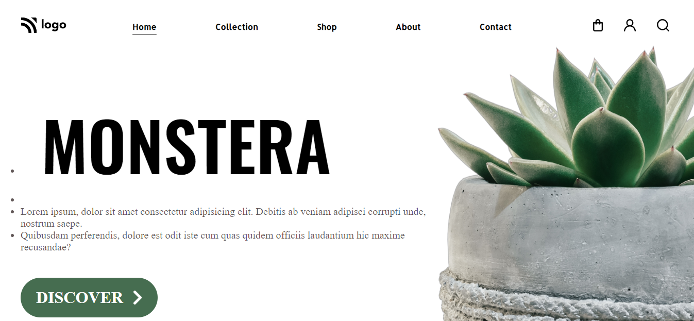

# Project 06: Plant HomePage using HTML  and CSS 

Chandrakala P

## Final Look of the Webpage:

## What I learnt from this Project?

- This project helped me to understand the whole idea of Html and css
- I learnt most of the basics tags in html and many properties in css.
- This project helped me to understand background-img and bgc buttons text-decoration, text-underline-offset, text-decoration-color in css and also positioning in css.

## Stacks and Tools:

- HTML and CSS
- HTML : list, p, div, li, ul, ol, heading tags, button, img, and many more.
- CSS: margin, padding, bgc, color, posiiton text-decorations align items, display, flex, text align, justify content, gap, bgi etc.

## It took around 4 hrs.
